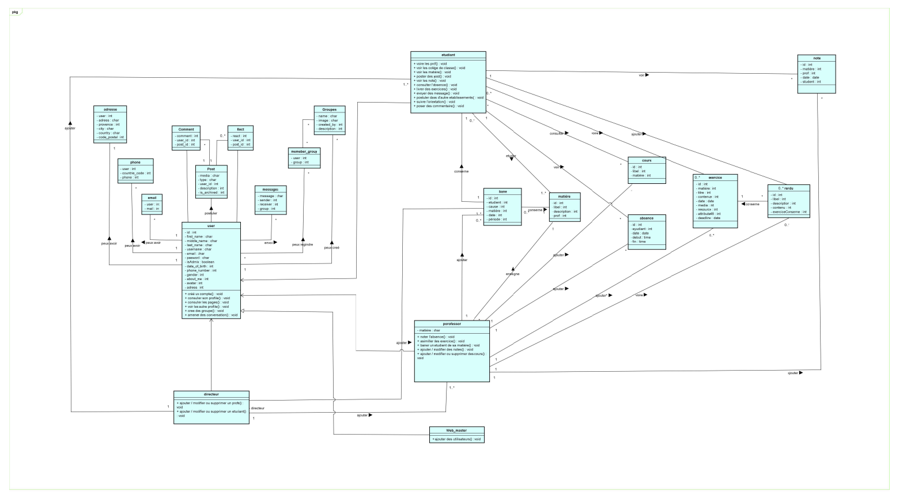
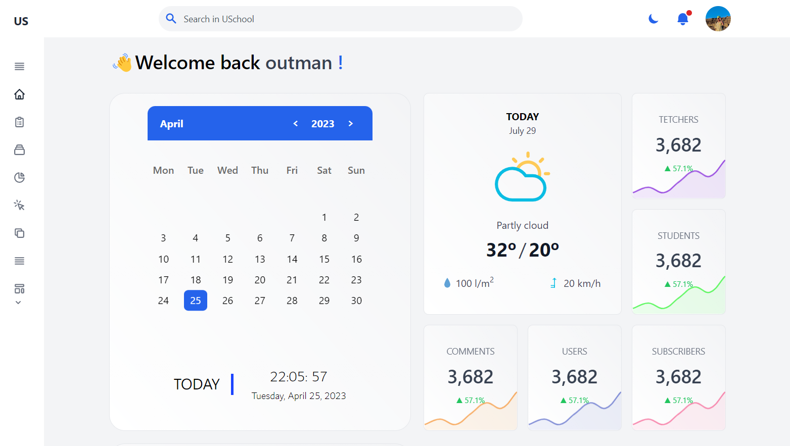

# USchool
###
This project aims to create a platform or social network exclusively for students to help them overcome common challenges such as lack of time, difficulty in keeping up with classes, lack of motivation, difficulty in finding quality learning resources, and communication problems with teachers. The platform will include virtual classrooms, a zone dedicated to learning and collaboration among students, and a homepage similar to those of Facebook or LinkedIn. It will be accessible in any country, city or village and can be used by anyone involved in the education sector.
###

###

